# RAM Cloud Security — UI Information Architecture & Navigation

## 1. Global Taxonomy & System Hierarchy

The application organizes cloud security operations and scientific machine learning research into seven primary domains. Each domain maps to dedicated operational workflows.

```mermaid
graph TD
    App[RAM Cloud Security Console] --> SEC[1. SECURITY]
    App --> ENV[2. ENVIRONMENT]
    App --> POS[3. POSTURE]
    App --> DET[4. DETECTION]
    App --> RES[5. RESEARCH]
    App --> RSP[6. RESPONSE]
    App --> ADM[7. ADMINISTRATION]

    SEC --> SEC_1[Overview Dashboard]
    SEC --> SEC_2[Security Findings]
    SEC --> SEC_3[Incident Investigation]

    ENV --> ENV_1[Assets Inventory]
    ENV --> ENV_2[Identities & IAM]
    ENV --> ENV_3[Workloads]
    ENV --> ENV_4[Network & VPC]

    POS --> POS_1[Misconfigurations]
    POS --> POS_2[Vulnerabilities]
    POS --> POS_3[Compliance Frameworks]
    POS --> POS_4[Attack Surface Exposure]

    DET --> DET_1[Event Telemetry Explorer]
    DET --> DET_2[Threat Activity & Emulation Runs]

    RES --> RES_1[Dataset Provenance]
    RES --> RES_2[EDA Explorer 14 Figures]
    RES --> RES_3[Experiments & Benchmark]
    RES --> RES_4[Model Evaluation Protocol]

    RSP --> RSP_1[Response Center]
    RSP --> RSP_2[Action Audit History]

    ADM --> ADM_1[Telemetry Integrations]
    ADM --> ADM_2[Detection Policies]
    ADM --> ADM_3[System Settings]
```



---

## 2. Complete Route Map & Module Inventory (23 Core Routes)

| Domain | Route Path | Screen Title | Primary User Persona | Current Implementation State |
| :--- | :--- | :--- | :--- | :--- |
| **Security** | `/security/overview` | Security Overview Dashboard | SOC Analyst, Security Lead | **Active** (Dynamic bindings to Rule Engine & EDA summary) |
| **Security** | `/security/findings` | Security Findings Inventory | SOC Analyst, Incident Responder | **Active** (Deterministic Rules Baseline A findings) |
| **Security** | `/security/findings/:id` | Finding Forensic Detail | Incident Responder | **Active** (Forensic evidence & Rule rationale) |
| **Security** | `/security/investigation` | Incident Investigation Workspace | Threat Hunter, Forensic Lead | **Active** (Observed activity timeline & correlation) |
| **Environment**| `/environment/assets` | Cloud Assets Inventory | Cloud Architect | **Connected** (EC2, S3, IAM from parsed events) |
| **Environment**| `/environment/assets/:id`| Asset Detail & Relationships | Cloud Architect | **Connected** (Event history & attached findings) |
| **Environment**| `/environment/identities`| IAM Principals & Roles | IAM Administrator, Auditor | **Connected** (14 sanitized actors: `IAMUser-01`, `Role-01`) |
| **Environment**| `/environment/workloads` | Workload Runtime Containers | Workload Security Engineer | **Coming Soon** (Phase 7 runtime monitoring) |
| **Environment**| `/environment/network` | Network Topology & VPCs | Network Security Engineer | **Coming Soon** (VPC Flow log integration) |
| **Posture** | `/posture/misconfigurations`| Cloud Misconfigurations | Compliance Auditor | **Connected** (Configuration Rule evaluation) |
| **Posture** | `/posture/vulnerabilities`| Vulnerabilities & CVEs | SecOps Engineer | **Not Connected** (AWS Inspector connector required) |
| **Posture** | `/posture/compliance` | Compliance Benchmarks (CIS) | GRC Lead | **Coming Soon** (CIS AWS Benchmark mapping) |
| **Posture** | `/posture/exposure` | Attack Surface Exposure | SecOps Engineer | **Connected** (Exposure Rule evaluation) |
| **Detection** | `/detection/events` | Telemetry Event Explorer | Forensic Analyst | **Active** (Dynamic ingestion of parsed records) |
| **Detection** | `/detection/threats` | Threat Activity & Emulation Runs | Threat Hunter | **Active** (83 Emulation Runs correlation) |
| **Research** | `/research/dataset` | Dataset Card & Provenance | Academic Reviewer, ML Engineer| **Active** (Audited 4-tier dataset metadata) |
| **Research** | `/research/eda` | Exploratory Analysis (14 Figs)| Academic Reviewer, ML Engineer| **Active** (14 publication-grade figures) |
| **Research** | `/research/experiments`| Experiment Benchmark Matrix | ML Engineer, Researcher | **Active** (Baseline A benchmark & future model slots) |
| **Research** | `/research/evaluation` | Evaluation & Metrics Protocol | Academic Reviewer, ML Engineer| **Active** (Multi-ground-truth evaluation metrics) |
| **Response** | `/response/center` | Safe Response Center | Incident Commander | **Active** (Policy-gated recommendations, Dry Run mode) |
| **Response** | `/response/history` | Action Audit History | Compliance Auditor | **Active** (Immutable local response log) |
| **Admin** | `/admin/integrations` | Ingestion Integrations | DevOps Engineer | **Active** (CloudTrail active, others pending) |
| **Admin** | `/admin/policies` | Rule & Engine Policies | Security Lead | **Active** (Deterministic rule toggles & weights) |
| **Admin** | `/admin/settings` | System Settings & Config | System Administrator | **Active** (Environment variables & thresholds) |

---

## 3. Global Navigation Shell Architecture

The navigation shell consists of three persistent ergonomic zones:

```
+----------------------------------------------------------------------------------------------------+
| [RAM ANTIVIRUS] [Environment: AWS-Lab (2,900 Evts)] [Global Search: Ctrl+K] [Alerts: 42] [Admin v0.2]|
+-----------------------+----------------------------------------------------------------------------+
| PRIMARY SIDEBAR       | BREADCRUMBS: Security > Findings > FINDING-CFG-001                         |
|                       | PAGE HEADER: Security Findings (42 Active Findings)    [Export] [Filter]   |
| > SECURITY            +----------------------------------------------------------------------------+
|   - Overview          | FILTER BAR: [Severity: All v] [Source: RuleEngine v] [Actor: All v] [Time] |
|   - Findings          +----------------------------------------------------------------------------+
|   - Investigation     | DATA VIEW CANVAS:                                                          |
|                       |                                                                            |
| > ENVIRONMENT         | [Data Table / Chart Matrix / Investigation Workspace Canvas]               |
|   - Assets            |                                                                            |
|   - Identities        |                                                                            |
|   - Workloads (Soon)  |                                                                            |
|   - Network (Soon)    |                                                                            |
|                       |                                                                            |
| > POSTURE             |                                                                            |
|   - Misconfigurations |                                                                            |
|   - Vulnerabilities   |                                                                            |
|                       |                                                                            |
| > DETECTION           |                                                                            |
|   - Events            |                                                                            |
|   - Threat Activity   |                                                                            |
|                       |                                                                            |
| > RESEARCH            |                                                                            |
|   - Dataset           |                                                                            |
|   - EDA Figures (14)  |                                                                            |
|   - Experiments       |                                                                            |
|   - Evaluation        |                                                                            |
|                       |                                                                            |
| > RESPONSE            |                                                                            |
|   - Response Center   |                                                                            |
|   - Action History    |                                                                            |
+-----------------------+----------------------------------------------------------------------------+
```

---

## 4. Universal Search & Filter Specification

### 4.1 Global Command Palette (`Ctrl+K` / `Cmd+K`)
Global search accepts natural tokens and structured syntax across all ingested records:
- `actor:Role-01` $\to$ Filters view to principal `Role-01`.
- `service:ec2` $\to$ Limits scope to EC2 events/findings.
- `rule:RULE-IAM-001` $\to$ Opens rule definition and matched findings.
- `event:StopLogging` $\to$ Locates CloudTrail tampering events.
- `fig:05` $\to$ Directly jumps to EDA Figure 05 in the Research workspace.

### 4.2 Standard Filter Bar Contract
Every list and explorer view implements a synchronized filter schema:
1. **Time Range Selector:** Preset intervals (`Last 15m`, `Last 1h`, `Full Dataset 55m`, `Custom UTC Window`).
2. **Severity Multi-Select:** Checkbox pills (`Critical`, `High`, `Medium`, `Low`, `Info`).
3. **Detection Source:** Multi-select (`Rule Engine [Active]`, `ML Anomaly [Phase 4]`, `Temporal Graph [Phase 5]`, `Evidence Fusion [Phase 6]`).
4. **Service Scope:** Multi-select filter across all 29 AWS services discovered during ingestion.
5. **Operational Activity Tier:** Filter by audited provenance (`Pure Detonation`, `Warmup/Cleanup`, `Operator TF`, `AWS Background`).
