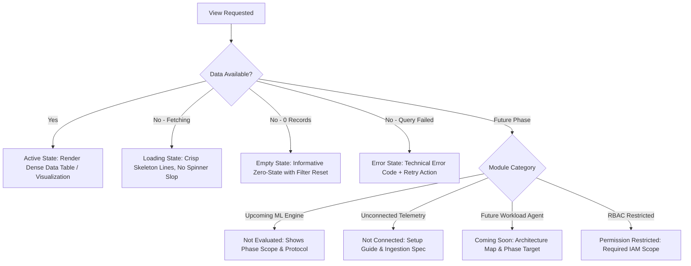

# RAM Cloud Security — UI/UX Design System Specification

## 1. Design Philosophy & Architectural Principles

RAM Cloud Security is an enterprise-grade cloud security operations and research platform. The interface is engineered around the **Anti-Slop Design Doctrine**: it is calm, data-dense, technical, trustworthy, and rigorously structured.

### 1.1 Core Tenets
1. **Utility & Density Over Decoration:** Information hierarchy is created through crisp typography, subtle borders, and whitespace—not oversized gradients, glowing cards, or decorative illustrations.
2. **Semantic Restraint:** Color is reserved strictly for operational state and security severity. Backgrounds remain neutral light tones to maximize legibility and minimize cognitive fatigue during long investigation sessions.
3. **Progressive Disclosure:** High-level signals (posture scores, alert counts, sequence tags) are immediately scannable; forensic details (raw telemetry fields, JSON payloads, baseline deviations) are accessible via inline drawers and modal inspectors without losing navigation context.
4. **Honest Data Provenance:** Every metric, finding, and chart explicitly states its analytical provenance (Deterministic Rule Engine vs. Audited Ground Truth vs. Future ML Inference). Unconnected or unmodeled capabilities are rendered with explicit, neutral state indicators—never fabricated placeholders.

---

## 2. Color System & Semantic Palette

All interface colors are defined in strict HSL tokens to ensure WCAG 2.1 AA/AAA compliance across light surfaces.

```
+-----------------------------------------------------------------------------------+
| BASE SURFACES (Neutral Light Foundation)                                           |
| Canvas Background : #F9FAFB (hsl(210, 20%, 98%))                                   |
| Surface Base      : #FFFFFF (hsl(0, 0%, 100%))                                     |
| Elevated Surface  : #F3F4F6 (hsl(215, 16%, 96%))                                   |
| Border Subdued    : #E5E7EB (hsl(220, 13%, 91%))                                   |
| Border Strong     : #D1D5DB (hsl(217, 12%, 84%))                                   |
+-----------------------------------------------------------------------------------+
| TYPOGRAPHY TOKENS (High Contrast Dark Neutrals)                                   |
| Primary Text      : #111827 (hsl(221, 39%, 11%)) — 14.5:1 contrast on white        |
| Secondary Text    : #4B5563 (hsl(215, 14%, 34%)) — 7.2:1 contrast on white         |
| Muted/Caption     : #6B7280 (hsl(220, 9%, 46%)) — 4.8:1 contrast on white          |
| Code / Monospace  : #0F172A (hsl(222, 47%, 11%))                                   |
+-----------------------------------------------------------------------------------+
| SECURITY SEVERITY & RISK PALETTE (Standardized Across All Modules)                 |
| Critical (Sev 4)  : Text: #991B1B | BG: #FEF2F2 | Border: #F87171 | Dot: #DC2626   |
| High     (Sev 3)  : Text: #9A3412 | BG: #FFF7ED | Border: #FDBA74 | Dot: #EA580C   |
| Medium   (Sev 2)  : Text: #854D0E | BG: #FEFCE8 | Border: #FDE047 | Dot: #CA8A04   |
| Low      (Sev 1)  : Text: #1E40AF | BG: #EFF6FF | Border: #93C5FD | Dot: #2563EB   |
| Info / Normal     : Text: #374151 | BG: #F3F4F6 | Border: #D1D5DB | Dot: #6B7280   |
+-----------------------------------------------------------------------------------+
| OPERATIONAL PROVENANCE PALETTE (Dataset Tiers & Pipeline Stages)                  |
| Pure Detonation   : #DC2626 (Adversarial Detonation Tier)                         |
| Warmup / Cleanup  : #EA580C (Stratus Orchestration Tier)                          |
| Operator Infra    : #2563EB (Terraform Lab Management Tier)                       |
| AWS Background    : #6B7280 (Internal Cloud Services Tier)                        |
| Status Success    : #059669 (Text: #065F46 | BG: #ECFDF5 | Border: #6EE7B7)        |
+-----------------------------------------------------------------------------------+
```

---

## 3. Typography Scale & Hierarchy

The interface utilizes standard system font stacks prioritizing immediate rendering speed and tabular alignment:
`font-family: -apple-system, BlinkMacSystemFont, "Segoe UI", Roboto, Helvetica, Arial, sans-serif, "Apple Color Emoji", "Segoe UI Emoji";`
`font-family-mono: ui-monospace, SFMono-Regular, Menlo, Monaco, Consolas, "Liberation Mono", "Courier New", monospace;`

| Role | Size | Line Height | Weight | Tracking | Usage |
| :--- | :--- | :--- | :--- | :--- | :--- |
| **Page Title** | 20px (1.25rem) | 28px | 600 (Semibold) | -0.015em | Top-level view header |
| **Section Header** | 16px (1.00rem) | 24px | 600 (Semibold) | -0.010em | Card/Table module title |
| **Subsection / Card Title**| 14px (0.875rem)| 20px | 600 (Semibold) | 0.000em | Sub-panel, drawer header |
| **Body Primary** | 14px (0.875rem)| 20px | 400 (Regular) | 0.000em | Standard table cells, paragraphs |
| **Body Small / Meta** | 12px (0.750rem)| 16px | 400 (Regular) | +0.010em| Timestamps, secondary labels |
| **Badge / Tag** | 11px (0.6875rem)| 14px | 600 (Semibold) | +0.020em| Severity chips, status tags |
| **Monospace / Code** | 12px (0.750rem)| 18px | 400 / 500 | 0.000em | API names, IAM ARNs, event IDs |

---

## 4. Spacing, Grid & Layout Geometry

The layout is built on an **8px base spacing grid** ($4\text{px}$ sub-grid for tight micro-elements).

```
+-----------------------------------------------------------------------------------+
| GLOBAL APPLICATION SHELL DIMENSIONS                                               |
| Top Navigation Bar     : Height 52px (Fixed)                                      |
| Primary Sidebar        : Width 240px (Expanded), 64px (Collapsed)                 |
| Sub-Navigation (if any): Width 200px                                              |
| Content Canvas Max     : 1680px centered (fluid down to 1024px)                   |
| Standard Card Padding  : 16px (Dense) / 20px (Default)                            |
| Table Cell Padding     : 8px 12px (Dense) / 10px 16px (Default)                   |
| Lateral Page Margins   : 24px (Desktop), 16px (Tablet/Mobile)                     |
| Card Corner Radius     : 4px (Subtle, crisp enterprise profile)                   |
| Elevation Shadows      : shadow-sm: 0 1px 2px 0 rgba(0, 0, 0, 0.05)               |
|                          shadow-md: 0 4px 6px -1px rgba(0, 0, 0, 0.08) (Modals)   |
+-----------------------------------------------------------------------------------+
```

---

## 5. UI State Matrix (Future-Proof System)

Every component and view in the product handles eight standardized operational states consistently:



### 5.1 Standardized State Badges

| State Name | Badge Styling | Descriptive Message Pattern |
| :--- | :--- | :--- |
| **Active** | `bg-emerald-50 text-emerald-800 border-emerald-300` | Operational telemetry / Rule engine live. |
| **Empty** | `bg-gray-100 text-gray-700 border-gray-300` | "No findings match the selected filter criteria." |
| **Loading** | `animate-pulse bg-gray-200 rounded` | Structural layout skeleton matching final table height. |
| **Error** | `bg-rose-50 text-rose-800 border-rose-300` | `[ERR_PARSER_TIMEOUT] Ingestion parser encountered EOF.` |
| **Not Connected** | `bg-amber-50 text-amber-800 border-amber-300` | `AWS Config integration not configured. Telemetry disabled.` |
| **Not Evaluated** | `bg-slate-100 text-slate-700 border-slate-300` | `Phase 4 ML Model inference not evaluated on this event.` |
| **Coming Soon** | `bg-indigo-50 text-indigo-800 border-indigo-300` | `Workload eBPF daemon targeted for Phase 7 implementation.` |
| **Permission Restricted**| `bg-zinc-100 text-zinc-600 border-zinc-300` | `Requires cloud:DescribeSecurityGroups authorization.` |

---

## 6. Accessibility & Visual Ergonomics Standards

1. **Color Independence:** No status is communicated solely by color. All severities and operational states pair color tokens with text labels and standardized icon glyphs (e.g., `Critical` badge includes a solid diamond glyph `◆`).
2. **Keyboard Navigation:** Full focus ring visibility (`outline: 2px solid #2563eb; outline-offset: 2px;`) across all data rows, filter buttons, drawer triggers, and pagination elements.
3. **Tabular Data Scannability:** Monospace alignment (`font-variant-numeric: tabular-nums;`) for timestamps, event counts, percentages, IP addresses, and hash strings.
